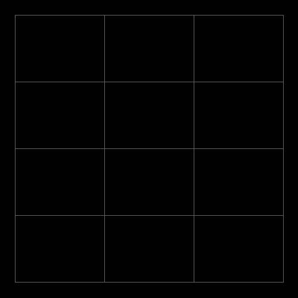
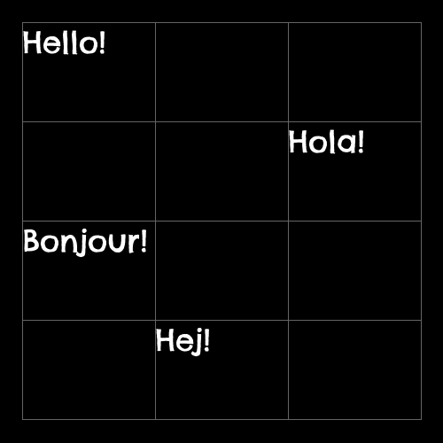
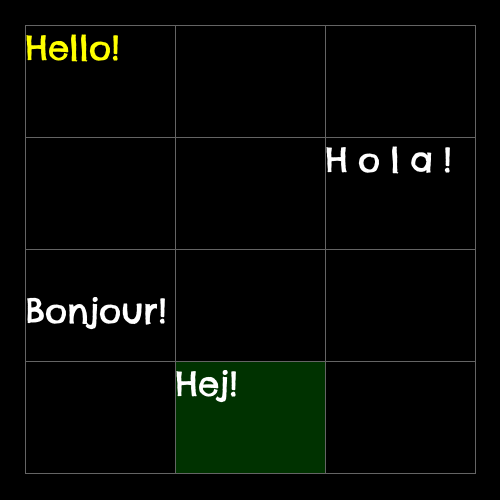

# Grid class

The `Grid` class draws text in a grid to a Pillow image.

## Initialisation

A `Grid` instance must be initialised with the number of columns and rows, the region to render within, and an optional default [`Style`](./style.md) for the cells.

For example, this code creates a `Grid` that's 90% the width of the image with three columns, 90% the height of the image with four rows, and centred within the image:

```python
from PIL import Image, ImageDraw
from PIL.ImageFont import truetype

from palign import Alignment, Grid, Percent, Style, make_image_region


image_region = make_image_region(500, 500)

image = Image.new("RGB", image_region.size)
draw = ImageDraw.Draw(image)

grid_region = image_region.region2(
    Alignment.Center,
    Alignment.Center,
    Percent(90),
    Percent(90),
)

style = Style(
    border_color=(100, 100, 100),
    border_width=1,
    font=truetype("tests/font/ChelseaMarket-Regular.ttf", 34),
)

grid = Grid(3, 4, grid_region, style=style)

grid.draw(draw)

image.save("./docs/images/grid-example-0.png", "png")
```

The `draw` function draws the grid to a Pillow `Draw` instance:

<figure markdown>
  
</figure>

## Setting text

To set the text at a given coordinate, use the grid's indexing to access the cell's `text` property:

```python
from PIL import Image, ImageDraw
from PIL.ImageFont import truetype

from palign import Alignment, Grid, Percent, Style, make_image_region


image_region = make_image_region(500, 500)

image = Image.new("RGB", image_region.size)
draw = ImageDraw.Draw(image)

style = Style(
    border_color=(100, 100, 100),
    border_width=1,
    font=truetype("tests/font/ChelseaMarket-Regular.ttf", 34),
)

grid_region = image_region.region2(
    Alignment.Center,
    Alignment.Center,
    Percent(90),
    Percent(90),
)

grid = Grid(3, 4, grid_region, style=style)

grid[0, 0].text = "Hello!"
grid[2, 1].text = "Hola!"
grid[1, 3].text = "Hej!"
grid[0, 2].text = "Bonjour!"

grid.draw(draw)

image.save("./docs/images/grid-example-1.png", "png")
```

<figure markdown>
  
</figure>

## Setting styles

To set a cell's style, use the grid's indexing to access the cell's `style` property:

```python
from PIL import Image, ImageDraw
from PIL.ImageFont import truetype

from palign import Alignment, Grid, Percent, Style, make_image_region


image_region = make_image_region(500, 500)

image = Image.new("RGB", image_region.size)
draw = ImageDraw.Draw(image)

style = Style(
    border_color=(100, 100, 100),
    border_width=1,
    font=truetype("tests/font/ChelseaMarket-Regular.ttf", 34),
)

grid_region = image_region.region2(
    Alignment.Center,
    Alignment.Center,
    Percent(90),
    Percent(90),
)

grid = Grid(3, 4, grid_region, style=style)

grid[0, 0].style.color = (255, 255, 0)
grid[0, 0].text = "Hello!"

grid[2, 1].style.tracking = 10
grid[2, 1].text = "Hola!"

grid[1, 3].style.background = (0, 50, 0)
grid[1, 3].text = "Hej!"

grid[0, 2].style.vertical = Alignment.Center
grid[0, 2].text = "Bonjour!"

grid.draw(draw)

image.save("./docs/images/grid-example-2.png", "png")
```


<figure markdown>
  
</figure>
