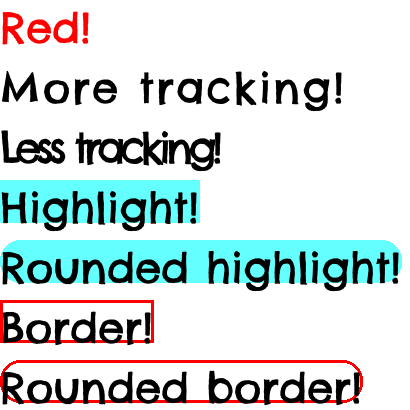
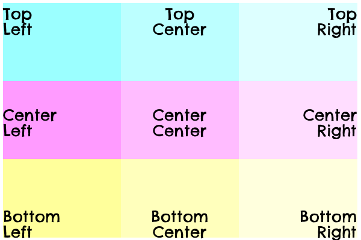

# Palign

[](https://codecov.io/gh/cariad/palign)

**Palign** is a Python package that helps to render and align text in [Pillow](https://python-pillow.org/).

## Examples

[`Text`](./text.md) draws text of a given [`Style`](./style.md) at a set of coordinates:

```python
from PIL import Image, ImageDraw
from PIL.ImageFont import truetype

from palign import Style, Text


# Create a Pillow Image and Draw as usual:
image = Image.new("RGB", (270, 60))
draw = ImageDraw.Draw(image)

# Create a Style to describe the font:
style = Style(
    font=truetype("tests/font/ChelseaMarket-Regular.ttf", 42),
)

# Create a text renderer:
text = Text(draw, style)

# Draw "Hello world!" at (0, 0):
text.draw_text("Hello world!", (0, 0))

# Same the image via Pillow:
image.save("./docs/images/example-0.png", "png")
```

<figure markdown>
  
</figure>

[`Style`](./style.md) can also describe borders, colour and tracking:

```python
from PIL import Image, ImageDraw
from PIL.ImageFont import truetype

from palign import Style, Text


image = Image.new("RGB", (410, 410), (255, 255, 255))
draw = ImageDraw.Draw(image)

style = Style(
    color=(0, 0, 0),
    font=truetype("tests/font/ChelseaMarket-Regular.ttf", 42),
)

text = Text(draw, style)

# Pass in a style to merge into the renderer's base style:
text.draw_text(
    "Red!",
    (0, 0),
    style=Style(color=(255, 0, 0)),
)

text.draw_text(
    "More tracking!",
    (0, 60),
    style=Style(tracking=2),
)

text.draw_text(
    "Less tracking!",
    (0, 120),
    style=Style(tracking=-5),
)

text.draw_text(
    "Highlight!",
    (0, 180),
    style=Style(background=(100, 255, 255)),
)

text.draw_text(
    "Rounded highlight!",
    (0, 240),
    style=Style(background=(100, 255, 255), border_radius=20),
)

text.draw_text(
    "Border!",
    (0, 300),
    style=Style(border_color=(255, 0, 0), border_width=3),
)

text.draw_text(
    "Rounded border!",
    (0, 360),
    style=Style(border_color=(255, 0, 0), border_radius=20, border_width=3),
)

image.save("./docs/images/example-1.png", "png")
```

<figure markdown>
  
</figure>

If you specify a region to render within (rather than just a point to render _at_) then text can aligned:

```python
from PIL import Image, ImageDraw
from PIL.ImageFont import truetype

from palign import Alignment, Percent, Style, Text, make_image_region


# Create an image region:
image_region = make_image_region(300, 720)

# Pass the image region's size into Image.new:
image = Image.new("RGB", image_region.size, (255, 255, 255))
draw = ImageDraw.Draw(image)

# We're going to build a region to render the first block of text into.
#
# We want this region to fill the entire width of the image, with a little
# margin on every edge for comfort.
#
# So, let's start by creating a subregion with that margin by contracting in:
margin_region = image_region.expand(-10)

# Now we'll create a subregion that starts in the top-left corner, fills 100%
# of the available width and is 70 pixels tall:
text_region = margin_region.region2(0, 0, Percent(100), 70).resolve()
# Note that we need to .resolve() the region to resolve the relative values to
# absolutes.

style = Style(
    border_color=(200, 200, 200),
    border_radius=3,
    border_width=1,
    color=(0, 0, 0),
    font=truetype("tests/font/ChelseaMarket-Regular.ttf", 21),
)

text = Text(draw, style)

for vertical in Alignment:
    for horizontal in Alignment:
        alignment = Style(horizontal=horizontal, vertical=vertical)

        match horizontal:
            case Alignment.Near:
                horizontal_name = "Left"
            case Alignment.Center:
                horizontal_name = "Center"
            case Alignment.Far:
                horizontal_name = "Right"

        match vertical:
            case Alignment.Near:
                vertical_name = "Top"
            case Alignment.Center:
                vertical_name = "Center"
            case Alignment.Far:
                vertical_name = "Bottom"

        t = f"{vertical_name} {horizontal_name}"
        text.draw_text(t, text_region, style=alignment)

        # Translate the region down by (text_region.height + 10) pixels for
        # the next block.
        text_region += (0, text_region.height + 10)

image.save("./docs/images/example-2.png", "png")
```

<figure markdown>
  
</figure>

To align text in a grid, use a [`Grid`](./grid.md):

```python
from PIL import Image, ImageDraw
from PIL.ImageFont import truetype

from palign import Alignment, Grid, Style, make_image_region


image_region = make_image_region(600, 400)

image = Image.new("RGB", image_region.size, (255, 255, 255))
draw = ImageDraw.Draw(image)

style = Style(
    color=(0, 0, 0),
    font=truetype("tests/font/ChelseaMarket-Regular.ttf", 26),
)

column_count = 3
row_count = 3

grid = Grid(
    column_count,
    row_count,
    image_region.expand(-10),
    style=style,
)

for vertical_index, vertical in enumerate(Alignment):
    for horizontal_index, horizontal in enumerate(Alignment):
        match horizontal:
            case Alignment.Near:
                horizontal_name = "Left"
            case Alignment.Center:
                horizontal_name = "Center"
            case Alignment.Far:
                horizontal_name = "Right"

        match vertical:
            case Alignment.Near:
                vertical_name = "Top"
            case Alignment.Center:
                vertical_name = "Center"
            case Alignment.Far:
                vertical_name = "Bottom"

        t = f"{vertical_name}\n{horizontal_name}"

        grid[horizontal_index, vertical_index].text = t
        grid[horizontal_index, vertical_index].style.horizontal = horizontal
        grid[horizontal_index, vertical_index].style.vertical = vertical


def color_bit(column: int) -> int:
    return 155 + int((100 / column_count) * column)


for x in range(column_count):
    for y in range(row_count):
        red = color_bit(x) if y == 0 else 255
        green = color_bit(x) if y == 1 else 255
        blue = color_bit(x) if y == 2 else 255
        grid[x, y].style.background = (red, green, blue)

grid.draw(draw)

image.save("./docs/images/grid.png", "png")
```

<figure markdown>
  
</figure>

For detailed usage information, see the [`Style`](./style.md), [`Text`](./text.md) and [`Grid`](./grid.md) classes.

## Installation

**Palign** requires Python 3.9 or later.

```console
pip install palign
```

## Support

Please raise bugs, request new features and ask questions at [github.com/cariad/palign/issues](https://github.com/cariad/palign/issues).

## Contributions

See [CONTRIBUTING.md](https://github.com/cariad/palign/blob/main/CONTRIBUTING.md) for contribution guidelines.

## The Project

**Palign** is &copy; 2022 Cariad Eccleston and released under the [MIT License](https://github.com/cariad/palign/blob/main/LICENSE) at [github.com/cariad/palign](https://github.com/cariad/palign).

## The Author

Hello! 👋 I'm **Cariad Eccleston** and I'm a freelance backend and infrastructure engineer in the United Kingdom. You can find me at [cariad.earth](https://cariad.earth), [github.com/cariad](https://github.com/cariad), [linkedin.com/in/cariad](https://linkedin.com/in/cariad) and on Mastodon at [@cariad@tech.lgbt](https://tech.lgbt/@cariad).
