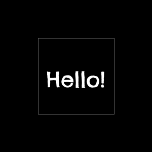

# Text class

The `Text` class renders text to a Pillow image.

## Initialisation

A `Text` instance must be initialised with a Pillow `Draw`. You can also pass in an optional base [`Style`](./style.md) for all the text to be rendered.

```python
from PIL import Image, ImageDraw
from PIL.ImageFont import truetype

from palign import Style, Text


image = Image.new("RGB", (100, 100))
draw = ImageDraw.Draw(image)

style = Style(
    font=truetype("tests/font/ChelseaMarket-Regular.ttf", 42),
)

renderer = Text(draw, style)
```

## Drawing text

The `draw_text` function requires the text to render and either a position or bounds to render within. You can also pass an optional [`Style`](./style.md) to merge with the base style.

### Drawing at a position

This code draws "Hello!" at the coordinates `(0, 0)`, or the top-left of the image:

```python
from PIL import Image, ImageDraw
from PIL.ImageFont import truetype

from palign import Style, Text


image = Image.new("RGB", (300, 300))
draw = ImageDraw.Draw(image)

style = Style(
    font=truetype("tests/font/ChelseaMarket-Regular.ttf", 42),
)

renderer = Text(draw, style)

renderer.draw_text("Hello!", (0, 0))

image.save("./docs/images/text-example-0.png", "png")
```

<figure markdown>
  
</figure>

### Aligning within a region

To draw the text with some alignment within a region, define that region than pass it to `draw_text` instead of a position.

For example, this code creates a region at the top-left of the image, with width and height of 200 pixels, then centers the text within it.

```python
from PIL import Image, ImageDraw
from PIL.ImageFont import truetype

from palign import Alignment, Region, Style, Text


image = Image.new("RGB", (300, 300))
draw = ImageDraw.Draw(image)

style = Style(
    border_color=(100, 100, 100),
    border_width=1,
    font=truetype("tests/font/ChelseaMarket-Regular.ttf", 42),
    horizontal=Alignment.Center,
    vertical=Alignment.Center,
)

region = Region.new(0, 0, 200, 200)

renderer = Text(draw, style)

renderer.draw_text("Hello!", region)

image.save("./docs/images/text-example-1.png", "png")
```

<figure markdown>
  
</figure>

### Relative alignment

To align a region (and not necessarily the text within it) you can create subregions with specific positions and sizes.

For example, this code uses `make_image_region` to describe the full size of the image, then calls `.region2()` to create a subregion 200 pixels tall and wide and aligned to the far edges of the image:

```python
from PIL import Image, ImageDraw
from PIL.ImageFont import truetype

from palign import Alignment, Style, Text, make_image_region


image_region = make_image_region(300, 300)

image = Image.new("RGB", image_region.size)
draw = ImageDraw.Draw(image)

style = Style(
    border_color=(100, 100, 100),
    border_width=1,
    font=truetype("tests/font/ChelseaMarket-Regular.ttf", 42),
    horizontal=Alignment.Center,
    vertical=Alignment.Center,
)

region = image_region.region2(Alignment.Far, Alignment.Far, 200, 200)

renderer = Text(draw, style)

renderer.draw_text("Hello!", region)

image.save("./docs/images/text-example-2.png", "png")
```

<figure markdown>
  
</figure>

### Relative sizes

The highest-level region must have explicit pixel dimensions, but subregions can have `Percent` lengths.

For example, this code creates a subregion that's 50% of the image's width and height and centred within the image:

```python
from PIL import Image, ImageDraw
from PIL.ImageFont import truetype

from palign import Alignment, Percent, Style, Text, make_image_region


image_region = make_image_region(300, 300)

image = Image.new("RGB", image_region.size)
draw = ImageDraw.Draw(image)

style = Style(
    border_color=(100, 100, 100),
    border_width=1,
    font=truetype("tests/font/ChelseaMarket-Regular.ttf", 42),
    horizontal=Alignment.Center,
    vertical=Alignment.Center,
)

region = image_region.region2(
    Alignment.Center,
    Alignment.Center,
    Percent(50),
    Percent(50),
)

renderer = Text(draw, style)

renderer.draw_text("Hello!", region)

image.save("./docs/images/text-example-3.png", "png")
```

<figure markdown>
  
</figure>
